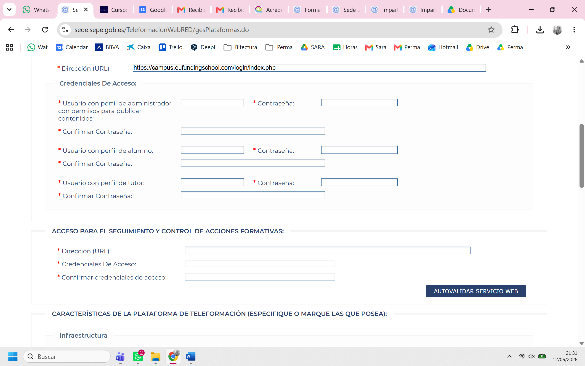
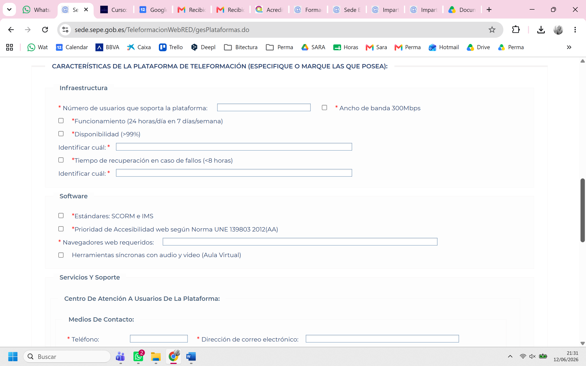

# Informe: Tareas en el VPS para acreditar el Campus Moodle ante el SEPE

**Fecha:** 2026-06-14
**Plataforma:** `https://campus.eufundingschool.com` (Moodle, VPS Coolify)
**Trámite:** Alta/acreditación de plataforma de teleformación en **SEPE — TeleformaciónWebRED** (`sede.sepe.gob.es/TeleformacionWebRED/gesPlataformas.do`)
**Objetivo:** Dejar el VPS y el Moodle en condiciones de **superar el formulario y la "Autovalidación del servicio web"** del SEPE, requisito para impartir acciones formativas en modalidad teleformación.

### Capturas originales del formulario (fuente)

---

## 1. Qué pide el formulario (lectura campo por campo de las dos capturas)

### Bloque A — Identificación y credenciales de acceso
- **Dirección (URL):** `https://campus.eufundingschool.com/login/index.php` ✅ (ya rellenado)
- **Credenciales de acceso** (el SEPE entra a comprobar la plataforma con 3 perfiles distintos):
  - **Usuario con perfil de administrador** "con permisos para publicar contenidos" + contraseña.
  - **Usuario con perfil de alumno** + contraseña.
  - **Usuario con perfil de tutor** + contraseña.

### Bloque B — Acceso para el SEGUIMIENTO y CONTROL de acciones formativas ⚠️ (lo crítico)
- **Dirección (URL)** del servicio.
- **Credenciales de acceso** + confirmación.
- Botón **"AUTOVALIDAR SERVICIO WEB"** → el SEPE prueba automáticamente que la plataforma expone un **servicio web de seguimiento** que cumple su especificación técnica. **Si no se supera la autovalidación, no se acredita la plataforma.**

### Bloque C — Características de la plataforma
**Infraestructura:**
- Nº de usuarios que soporta la plataforma (dato a declarar).
- Ancho de banda **300 Mbps** (checkbox).
- Funcionamiento **24 h/día, 7 días/semana**.
- Disponibilidad **> 99 %** ("identificar cuál").
- Tiempo de recuperación en caso de fallos **< 8 horas** ("identificar cuál").

**Software:**
- Estándares **SCORM e IMS**.
- Prioridad de **Accesibilidad web según UNE 139803:2012 (nivel AA)**.
- **Navegadores web requeridos** (a declarar).
- **Herramientas síncronas con audio y vídeo (Aula Virtual)**.

**Servicios y soporte:**
- Centro de atención a usuarios: **teléfono** y **correo electrónico** de contacto.

---

## 2. Tareas a realizar en el VPS / Moodle

Marcadas por prioridad: 🔴 bloqueante · 🟠 obligatoria · 🟢 declarativa/configuración.

### 🔴 T1 — Servicio web de seguimiento SEPE (Bloque B / "Autovalidar servicio web")
Es el **punto que más trabajo y riesgo tiene**. El SEPE no se conforma con que el alumno entre: exige un **servicio web** por el que el propio SEPE pueda **consultar de forma automatizada los datos de seguimiento** de cada acción formativa (conexiones del alumno, tiempos de dedicación, progreso, resultados).
- Hay que **exponer un endpoint** (URL + credenciales) que implemente **la especificación técnica del servicio web del SEPE** (manual de TeleformaciónWebRED).
- En Moodle esto **no viene de serie**: requiere instalar/desarrollar un **plugin/conector** que traduzca los datos de Moodle al formato que pide el SEPE y que pase la autovalidación.
- **Acción inmediata:** descargar de la sede del SEPE la **especificación/manual técnico vigente** del servicio web de seguimiento (WSDL/estructura de datos) para conocer el contrato exacto antes de implementar. → *Ver dudas en §4.*

### 🟠 T2 — Cuentas de prueba con los 3 perfiles (Bloque A)
- Crear en el Moodle:
  - 1 cuenta **administrador** con permisos para publicar contenidos.
  - 1 cuenta **alumno** de demostración.
  - 1 cuenta **tutor** de demostración.
- Idealmente, **un curso de muestra publicado** (con contenido SCORM, una actividad y el aula virtual visible) para que el evaluador del SEPE pueda navegar y comprobar funcionalidades con esas cuentas.
- Entregar usuario/contraseña en el formulario.

### 🟠 T3 — HTTPS, dominio y disponibilidad del login
- `campus.eufundingschool.com` debe estar **publicado con certificado SSL válido** y el `login/index.php` accesible públicamente (el SEPE accede desde fuera).
- Verificar que no hay bloqueos por IP/firewall que impidan el acceso del evaluador ni del servicio web.

### 🟠 T4 — SCORM e IMS (Bloque C / Software)
- Activar y verificar en Moodle el módulo **SCORM** (`mod_scorm`) y **paquete de contenido IMS** (`mod_imscp`).
- Subir al curso de muestra **un paquete SCORM** funcionando, como evidencia.

### 🟠 T5 — Aula Virtual (herramientas síncronas audio/vídeo)
- Instalar e integrar una herramienta de **videoconferencia/clase en directo**: **BigBlueButton** (la integración nativa habitual en Moodle), o alternativa (Jitsi/Zoom).
- Dejar una sala/actividad visible en el curso de muestra como evidencia.

### 🟢 T6 — Infraestructura y SLA (declarar y poder justificar)
- **Ancho de banda 300 Mbps:** confirmar capacidad de red del VPS/host (Hetzner) y dejarlo documentado.
- **24/7 + disponibilidad >99% + recuperación <8h:** establecer y **documentar**:
  - Monitorización/uptime (alertas).
  - **Backups** periódicos y procedimiento de **restauración < 8 h** probado.
  - Plan ante caídas.
- Estimar y declarar el **nº de usuarios soportados** (según recursos del VPS).

### 🟢 T7 — Accesibilidad UNE 139803:2012 (AA)
- Usar/ajustar un **tema de Moodle accesible** (Moodle moderno cumple WCAG 2.0 AA, base de esa UNE).
- Guardar evidencia/declaración de conformidad de accesibilidad.

### 🟢 T8 — Navegadores soportados y soporte a usuarios
- Declarar navegadores: **Chrome, Firefox, Edge, Safari** (versiones actuales).
- Definir **teléfono + email** del centro de atención a usuarios y, si procede, horario de soporte.

---

## 3. Checklist de entregables para rellenar el formulario

| Campo del formulario | Qué entregar | Estado |
|---|---|---|
| URL plataforma | `campus.eufundingschool.com/login/index.php` | ✅ |
| Admin / Alumno / Tutor (usuario+pass) | Crear 3 cuentas (T2) | ⬜ |
| URL + credenciales servicio web seguimiento | Endpoint SEPE implementado (T1) | ⬜ 🔴 |
| Autovalidar servicio web | Pasar la validación automática | ⬜ 🔴 |
| Nº usuarios soportados | Cifra justificable (T6) | ⬜ |
| Ancho banda 300 Mbps / 24-7 / >99% / <8h | Documentación SLA (T6) | ⬜ |
| SCORM e IMS | Módulos activos + evidencia (T4) | ⬜ |
| Accesibilidad UNE 139803:2012 AA | Tema accesible + declaración (T7) | ⬜ |
| Navegadores requeridos | Lista (T8) | ⬜ |
| Aula Virtual síncrona | BBB/Jitsi instalado (T5) | ⬜ |
| Teléfono + email soporte | Datos de contacto (T8) | ⬜ |

---

## 4. Dudas / cosas a confirmar antes de ejecutar

1. **Servicio web SEPE (T1) — lo más importante:** ¿tenemos ya descargada la **especificación técnica vigente** del servicio web de seguimiento de TeleformaciónWebRED? Sin el contrato exacto (WSDL/campos) no se puede garantizar pasar la autovalidación. **Es la primera tarea a resolver.**
2. ¿Existe ya algún **plugin Moodle–SEPE** comprado/contratado, o hay que desarrollarlo a medida?
3. ¿Para qué tipo de formación es la acreditación? (especialidades del Catálogo / certificados de profesionalidad en teleformación) — afecta a requisitos adicionales de la entidad, no solo de la plataforma.
4. Confirmar capacidad real de **300 Mbps** del proveedor del VPS y el **nº de usuarios** que queremos declarar.

---

## 5. Próximos pasos recomendados (orden)

1. **Conseguir la especificación del servicio web del SEPE** (descarga en la propia sede / manual TeleformaciónWebRED).
2. Decidir **plugin vs. desarrollo a medida** para el servicio web de seguimiento.
3. En paralelo (no bloqueante): crear cuentas de prueba (T2), curso de muestra con SCORM (T4), instalar Aula Virtual (T5).
4. Documentar SLA/infraestructura (T6) y accesibilidad (T7).
5. Rellenar el formulario y lanzar **"Autovalidar servicio web"** en entorno de pruebas antes del envío definitivo.

---

> **Resumen en una línea:** lo difícil no es publicar el Moodle (eso ya está casi), sino **implementar el servicio web de seguimiento que exige el SEPE y pasar su "Autovalidación"**; todo lo demás (cuentas, SCORM, aula virtual, SLA, accesibilidad) es configuración y documentación.
